# Aplicación para el Servidor Web

<div align="center">


**Repositorio Académico - Desarrollo de Aplicaciones Web del Lado del Servidor**

[Explorar Prácticas](#estructura-del-repositorio) • [Documentación](#documentación) • [Contribuidores](#integrantes-del-equipo)

</div>

---

## 📚 Información del Curso

| Campo | Información |
|-------|-------------|
| **Universidad** | ULEAM (Universidad Laica Eloy Alfaro de Manabí) |
| **Carrera** | Ingeniería de Software |
| **Nivel** | Quinto Semestre |
| **Asignatura** | Aplicación para el Servidor Web |
| **Docente** | Ing. John Cevallos |
| **Período Lectivo** | 2025–2026 (1) |
| **Repositorio** | [DavidJaramillo132/aplicacion-para-el-servidor-web](https://github.com/DavidJaramillo132/aplicacion-para-el-servidor-web) |

## 👥 Integrantes del Equipo

<table>
  <tr>
    <td align="center">
      <b>Kelly Canchingre</b><br>
      <sub>Arquitecta de Software</sub>
    </td>
    <td align="center">
      <b>David Jaramillo</b><br>
      <sub>Desarrollador Principal</sub>
    </td>
    <td align="center">
      <b>Kevin Calderón</b><br>
      <sub>Especialista en Datos</sub>
    </td>
  </tr>
</table>

## 🎯 Descripción del Proyecto

Este repositorio contiene el trabajo completo desarrollado para la asignatura **"Aplicación para el Servidor Web"**, que abarca una progresión estructurada desde conceptos fundamentales de desarrollo web hasta la implementación de tecnologías avanzadas de comunicación en tiempo real.

El proyecto está organizado en parciales, donde cada uno contiene múltiples prácticas que abordan diferentes aspectos del desarrollo backend moderno, incluyendo:

- 🐍 Desarrollo frontend con Flask (Python)
- 📘 Programación con TypeScript y POO
- 🏗️ Arquitecturas backend escalables
- 🗄️ Gestión de bases de datos con ORMs
- 🚀 APIs REST con frameworks empresariales
- 🔄 APIs GraphQL modernas
- ⚡ Comunicación en tiempo real con WebSockets

## 📂 Estructura del Repositorio

```
aplicacion-para-el-servidor-web/
│
├── PrimerParcial/                    # Primer Período Académico
│   ├── practica1-frontend/           # Flask - Frontend Web
│   ├── practica2-TypeScript/         # TypeScript POO
│   ├── practica3-backend/            # Backend con Capas
│   ├── practica4-TypeORM/            # ORM y Persistencia
│   ├── practica5-NestJS/             # Framework NestJS
│   │   ├── practicaEnClase/         # Ejercicios en clase
│   │   └── TallerTarea/             # Tareas asignadas
│   ├── practica6-graph-ql/           # API GraphQL
│   ├── practica6-GraphQL-clase/      # Comparativa REST vs GraphQL
│   ├── practica7-web-socket/         # WebSockets
│   ├── practica7-web-socket-clase/   # Comparativa REST vs WS
│   └── README.md                     # Documentación del parcial
│
├── .gitignore                        # Archivos ignorados
└── README.md                         # Este archivo
```

## 🚀 Tecnologías Utilizadas

### Lenguajes de Programación
- **Python 3.8+** - Backend con Flask
- **TypeScript 5.x** - Tipado estático para JavaScript
- **JavaScript ES6+** - Target de compilación

### Frameworks y Bibliotecas Backend
- **Flask 2.x** - Microframework web de Python
- **NestJS 11.x** - Framework progresivo Node.js
- **Express 5.x** - Framework web minimalista
- **TypeORM 0.3.x** - ORM para TypeScript/JavaScript

### APIs y Protocolos
- **REST API** - Arquitectura de servicios web
- **GraphQL** - Lenguaje de consulta para APIs
- **WebSockets** - Comunicación bidireccional
- **Socket.IO** - Biblioteca de WebSockets

### Bases de Datos
- **SQLite** - Base de datos embebida para desarrollo
- **PostgreSQL** - Base de datos relacional (configuración alternativa)

### Herramientas de Desarrollo
- **Node.js 16+** - Entorno de ejecución JavaScript
- **npm** - Gestor de paquetes Node
- **ts-node-dev** - Desarrollo TypeScript con hot-reload
- **Jest** - Framework de testing

### Otros
- **Apollo Server** - Servidor GraphQL
- **Reflect Metadata** - Metadata reflection API
- **RxJS** - Programación reactiva
- **dotenv** - Variables de entorno

## 📖 Primer Parcial

### Vista General de Prácticas

| # | Práctica | Tecnología Principal | Puerto | Tipo |
|---|----------|---------------------|--------|------|
| 1 | Frontend con Flask | Python + Flask | 5000 | Web App |
| 2 | TypeScript POO | TypeScript | - | Console |
| 3 | Backend por Capas | TypeScript | - | Console |
| 4 | TypeORM | TypeScript + SQLite | - | Console |
| 5 | NestJS Framework | NestJS + REST | 3000 | API REST |
| 6 | GraphQL | NestJS + GraphQL | 3001 | API GraphQL |
| 7 | WebSockets | NestJS + Socket.IO | 3000 | Real-time |

### Progresión de Aprendizaje

```mermaid
graph TD
    A[Práctica 1: Flask] --> B[Práctica 2: TypeScript]
    B --> C[Práctica 3: Backend Capas]
    C --> D[Práctica 4: TypeORM]
    D --> E[Práctica 5: NestJS]
    E --> F[Práctica 6: GraphQL]
    F --> G[Práctica 7: WebSockets]
    
    style A fill:#3776AB
    style B fill:#007ACC
    style C fill:#007ACC
    style D fill:#FFA500
    style E fill:#E0234E
    style F fill:#E10098
    style G fill:#010101
```



**[📄 Ver documentación completa del Primer Parcial →](./PrimerParcial/README.md)**

## 🛠️ Instalación y Configuración

### Prerrequisitos Globales

```bash
# Verificar instalaciones
node --version    # v16.0.0 o superior
npm --version     # v8.0.0 o superior
python --version  # 3.8 o superior (solo para práctica 1)
```

### Instalación de Dependencias Globales (Opcional)

```powershell
# TypeScript global
npm install -g typescript

# NestJS CLI global
npm install -g @nestjs/cli

# ts-node para ejecución TypeScript
npm install -g ts-node
```

### Clonar el Repositorio

```bash
git clone https://github.com/DavidJaramillo132/aplicacion-para-el-servidor-web.git
cd aplicacion-para-el-servidor-web
```

### Instalación por Práctica

Cada práctica tiene sus propias dependencias. Navegar a la carpeta específica e instalar:

```powershell
# Para proyectos Python (práctica 1)
cd PrimerParcial/practica1-frontend
pip install flask

# Para proyectos Node.js/TypeScript (prácticas 2-7)
cd PrimerParcial/practica5-NestJS/TallerTarea
npm install
```

## 🎓 Conceptos Aprendidos

### Arquitectura y Diseño
- ✅ Arquitectura por Capas (Layered Architecture)
- ✅ Domain-Driven Design (DDD)
- ✅ Patrón Repository
- ✅ Inyección de Dependencias
- ✅ Separación de Responsabilidades (SoC)
- ✅ Principios SOLID

### Paradigmas de Programación
- ✅ Programación Orientada a Objetos (POO)
- ✅ Programación Funcional
- ✅ Programación Asíncrona
- ✅ Programación Reactiva (RxJS)

### Patrones de Diseño
- ✅ Singleton
- ✅ Factory
- ✅ Decorator (TypeScript/NestJS)
- ✅ Observer (WebSockets)
- ✅ Repository Pattern

### APIs y Comunicación
- ✅ REST APIs (GET, POST, PUT, DELETE)
- ✅ GraphQL (Queries, Mutations, Subscriptions)
- ✅ WebSockets (Eventos bidireccionales)
- ✅ HTTP/HTTPS
- ✅ CORS

### Persistencia de Datos
- ✅ ORM (Object-Relational Mapping)
- ✅ Entidades y Relaciones (1:1, 1:N, N:M)
- ✅ Migraciones de BD
- ✅ Seeding de datos
- ✅ Transacciones

## 📚 Documentación

Cada práctica cuenta con su propia documentación detallada:

### Primer Parcial
- [Práctica 1 - Flask Frontend](./PrimerParcial/practica1-frontend/README.md)
- [Práctica 2 - TypeScript POO](./PrimerParcial/practica2-TypeScript/README.md)
- [Práctica 3 - Backend Capas](./PrimerParcial/practica3-backend/README.md)
- [Práctica 4 - TypeORM](./PrimerParcial/practica4-TypeORM/README.md)
- [Práctica 5 - NestJS](./PrimerParcial/practica5-NestJS/README.md)
- [Práctica 6 - GraphQL](./PrimerParcial/practica6-graph-ql/README.md)
- [Práctica 7 - WebSockets](./PrimerParcial/practica7-web-socket/README.md)

## 🔧 Comandos Útiles

### Comandos por Tecnología

```powershell
# Python/Flask (Práctica 1)
python app.py                 # Ejecutar servidor Flask

# TypeScript/Node.js (Prácticas 2-4)
npm run dev                   # Desarrollo con hot-reload
npm run build                 # Compilar a JavaScript
npm start                     # Ejecutar versión compilada

# NestJS (Prácticas 5-7)
npm run start:dev             # Desarrollo con watch mode
npm run start:debug           # Modo debug
npm run start:prod            # Producción
npm run build                 # Compilar proyecto
npm run test                  # Ejecutar tests
npm run test:e2e              # Tests end-to-end
npm run lint                  # Linter
```

### Gestión de Base de Datos

```powershell
# TypeORM
npm run typeorm migration:run      # Ejecutar migraciones
npm run typeorm migration:revert   # Revertir migración
npm run typeorm migration:generate # Generar migración
```

## 🧪 Testing

```powershell
# Tests unitarios
npm run test

# Tests con cobertura
npm run test:cov

# Tests E2E
npm run test:e2e

# Tests en modo watch
npm run test:watch
```

## 📦 Despliegue

### Variables de Entorno

Crear archivo `.env` en cada proyecto que lo requiera:

```env
# Base de datos
DB_TYPE=sqlite
DB_DATABASE=database.sqlite

# Servidor
PORT=3000
NODE_ENV=development

# Otros
JWT_SECRET=your-secret-key
```

### Construcción para Producción

```powershell
# Compilar proyecto
npm run build

# Ejecutar versión de producción
npm run start:prod
```

## 🤝 Contribución

Este es un repositorio académico. Las contribuciones están limitadas a los miembros del equipo:
- Kelly Canchingre
- David Jaramillo
- Kevin Calderón

## 📄 Licencia

Este proyecto es de uso académico para la Universidad ULEAM.

## 📞 Contacto

Para consultas sobre el proyecto:
- **Repositorio:** [github.com/DavidJaramillo132/aplicacion-para-el-servidor-web](https://github.com/DavidJaramillo132/aplicacion-para-el-servidor-web)
- **Universidad:** ULEAM - Universidad Laica Eloy Alfaro de Manabí
- **Carrera:** Ingeniería de Software

## 🌟 Recursos Adicionales

### Documentación Oficial
- [Flask Documentation](https://flask.palletsprojects.com/)
- [TypeScript Documentation](https://www.typescriptlang.org/docs/)
- [NestJS Documentation](https://docs.nestjs.com/)
- [TypeORM Documentation](https://typeorm.io/)
- [GraphQL Documentation](https://graphql.org/learn/)
- [Socket.IO Documentation](https://socket.io/docs/)

### Herramientas Recomendadas
- **Visual Studio Code** - Editor de código
- **Postman** - Cliente API REST
- **GraphQL Playground** - Cliente GraphQL
- **DB Browser for SQLite** - Visualizador de base de datos
- **Git** - Control de versiones

### Extensiones VS Code Recomendadas
- ESLint
- Prettier
- TypeScript Vue Plugin
- REST Client
- GraphQL
- Python
- SQLite Viewer

---

<div align="center">

**Desarrollado con 💻 por estudiantes de Ingeniería de Software - ULEAM**

*Período 2025-2026*

</div>
